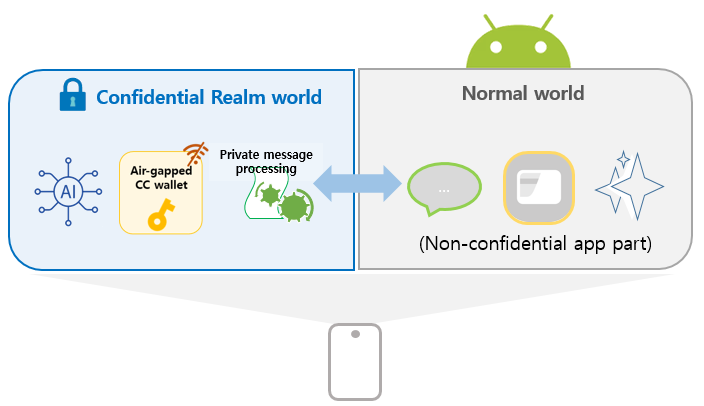
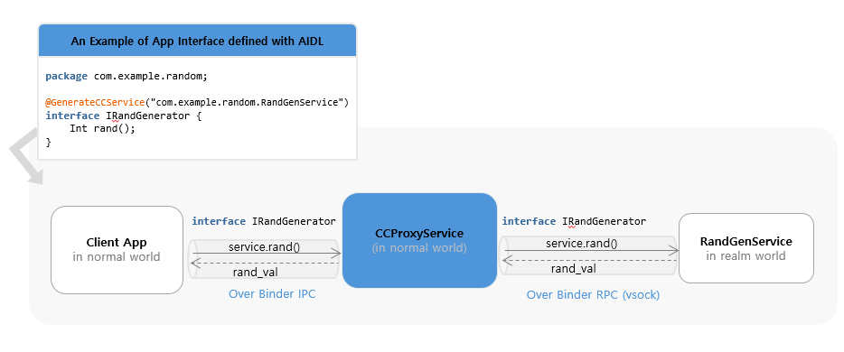

# Extending Confidential Computing for Android

Mobile applications increasingly handle sensitive data and security-critical workloads, including crypto wallets, digital identity, and on-device AI inference that leverages personal data to provide valuable, personalized experiences in users’ daily lives. As these use cases expand, stronger isolation guarantees than those offered by the traditional Trusted Execution Environments (TEEs) like Arm TrustZone are becoming necessary. This need applies not only to system and OEM-provided applications but also for the growing number of third-party apps installed from app stores that now routinely process sensitive information.

To address this need and accelerate the adoption of confidential computing on end user devices, we extend the Android OS with confidential computing capabilities based on our [Islet RMM](https://github.com/islet-project/islet) atop Arm CCA.

Our approach enables Android application code to run inside a realm (confidential VM). The core concepts of our design are:

- *Transparency to existing client applications*

  Applications executing confidentially within a realm can seamlessly interact with client applications in the normal world, without requiring any modifications to client-side code.

- *Developer-friendly confidential application model*

   - Confidential App parts can be developed using standard Android APIs, allowing developers to reuse existing knowledge without additional learning overhead.
   - Existing applications can be incrementally adapted by migrating only security-critical components into a realm with minimal changes, such as annotating code or updating the manifest.

- *Built on well-known foundation*

  The design builds upon the Android Virtualization Framework and Microdroid as the execution environment for realms, leveraging a mature and production-ready infrastructure originally designed for launching and managing protected virtual machines.

# Key Approach Ideas #

The lift and shift approach of running an entire Android application inside a realm streamlines migration to CC-based execution, but it requires the full Android Runtime and tight interaction with normal-world Android OS components. This significantly increases system complexity, demands heavyweight runtime support, enlarges the attack surface, and requires intrusive modifications to core components such as the kernel, Binder, zygote, and system_server.

We aim to preserve compatibility with Android Framework while maintaining App confidentiality and minimizing development friction.
To achieve these goals, our design is built upon four core ideas.

## I. Code Split for Lightweight and Secure Execution

We adopt a code-splitting approach, where only the security-sensitive parts of the application are executed inside the realm, while the rest remains in the normal world. This design:

   - Avoids modifications to core Android OS components.
   - Enables a lightweight runtime within a realm.
   - Reduces the attack surface.

## II. Automated Inter-World Communication via AIDL-Based Binder and Android Service Abstraction

To preserve existing application behavior and interfaces, we use the Android Service class as the unit of code splitting, as it naturally provides modular and reusable components while supporting communication across process boundaries via AIDL-based Binder IPC.

While AIDL interfaces typically rely on the Android kernel’s Binder IPC for inter-process communication, they do not support communication between the Normal World and the Realm World. To bridge this gap, we provide an annotation that transforms a standard AIDL interface into one capable of inter-world communication. Applying this annotation automatically generates (1) a Service in the Normal World that handles Binder IPC requests, and (2) a corresponding interface that leverages Android's RPC Binder over sockets, enabling method calls across the two worlds.

By running as Android services inside the Realm, confidential components can be invoked by existing client applications without any modifications, just like regular Android services. This approach ensures transparency, modularity, and seamless integration with existing applications.

The detailed design of transparent invocation of realm services from the normal world is described in later chapters.

## III. Seamless Integration with CC

Our framework provides comprehensive integration with Arm CCA through the Islet RMM, enabling Android services to leverage hardware-rooted security primitives. Key CC services include remote attestation for runtime integrity verification, secure provisioning for trusted asset delivery, secret derivation with specialized sealing keys and encrypted storage for persistent data protection. Services can generate device-unique secrets through the hardware-protected key hierarchy and use sealing mechanisms to encrypt data that is cryptographically bound to the specific realm and platform configuration. This ensures that sealed data can only be unsealed by the same realm running on the same platform with the same security configuration.

These capabilities work together to provide a seamless confidential computing environment that preserves compatibility with existing Android development practices while delivering strong hardware-enforced security guarantees for protecting sensitive application data and operations.

## IV. Lightweight Runtime Without Full Android Framework

To minimize the attack surface and enable fast startup, we remove the dependency on the full Android Runtime inside the realm.
Instead, we construct a lightweight execution environment that:

   - Directly instantiates application classes.
   - Executes Java application logic using only the Dalvik VM from Android ART.
   - Eliminates unnecessary Android framework dependencies.

This enables efficient execution of Java-based Android application code inside the realm with minimal overhead. Implementation details are discussed in Chapters 3 and 4.

# Demonstration

Our implementation is applied to AOSP 15 and runs on Arm CCA–enabled Android virtual devices (Cuttlefish).

As a concrete example, we present an end-to-end confidential computing workflow by integrating our framework into TensorFlow Lite BERT-QA, where an AI model operates entirely within a secure realm. The demonstration highlights the use of remote attestation, showcasing how sensitive data—specifically the AI model in this case—can be securely provisioned and stored on user devices. Furthermore, it illustrates how AI model inference is conducted confidentially, ensuring data privacy and security throughout the entire process.

This repository hosts the source for the documentation site for confidential computing on Android.

📚 [Visit the docs](https://islet-project.github.io/odcc-android-cc-docs/intro.html)
