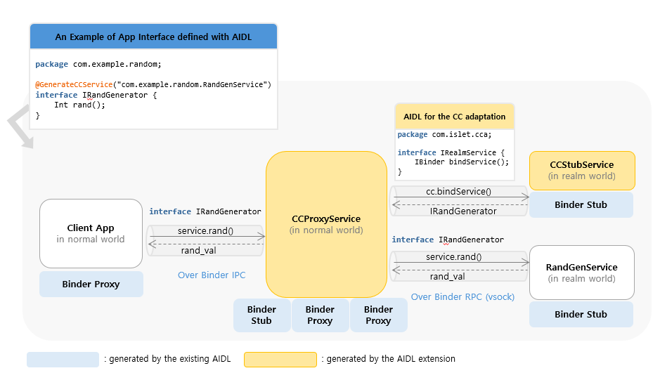

# AIDL-Generated Components for Confidential Computing on Android

This document explains which components are generated by the AIDL tool and why they are generated.



## 1) Source annotation

Code generation for confidential computing on Android starts from the AIDL annotation:


```java
@GenerateCCService(FQCN="com.example.RandGenService")
```

The `FQCN`(Fully Qualified Class Name) value is the key input used by the build-time generator.

> For detailed integration steps, see [How to Integrate Confidential Computing into Android](./odcc-ccplugin.md).

## 2) What is generated for CC Proxy

For host-side CC Proxy, the AIDL tool generates:

1. **CCProxyService**
2. **AndroidManifest** for the proxy service

Both are generated using the annotation `FQCN` value as the service identity.

### Why this is required

Even after a service provider moves the target service to the Realm, existing client apps must still be able to call `bindService(...)` with the **same FQCN** they already use.

By generating them from the same `FQCN`, we preserve client compatibility:

- clients keep the same binding target
- AIDL call paths continue to work without client-side changes

## 3) What is generated for CC Stub

CC Stub is responsible for initializing the CC Service in the Realm. To do that, it must know the target service class identity (`FQCN`).

So, at build time, the AIDL tool generates an **asset file** that contains the target service `FQCN` (again from `@GenerateCCService(...)`).

At runtime, CC Stub reads this generated value and uses it to initialize the target CC Service.

## 4) Where to find generated files in example apps

In our example apps, generated components are placed in app-specific directories.  
Please refer to the directories below in each example app repository:

- **[odcc-example-aosp](https://github.sec.samsung.net/SYSSEC/odcc-example-aosp/tree/on-device-cc/OdccExampleServiceOrig/gen)**: `<odcc-example-aosp>/OdccExampleServiceOrig/gen`
- **[odcc-tf-lite-bert-qa](https://github.sec.samsung.net/SYSSEC/odcc-tf-lite-bert-qa/tree/on-device-cc/gen)**: `<odcc-tf-lite-bert-qa>/gen`
