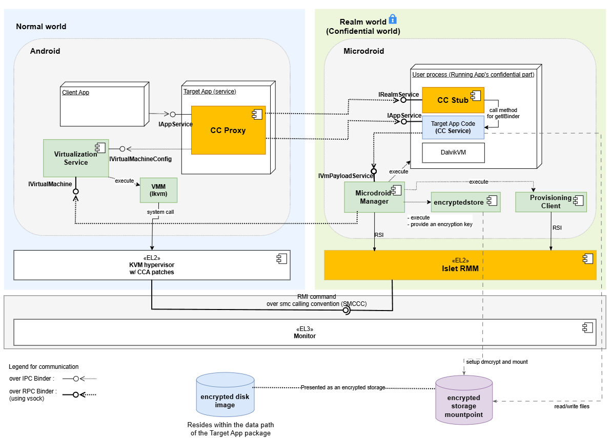

# Architecture Overview

This document describes how the system extends Android to support confidential computing by allowing selected app code to run inside a protected execution environment.

The architecture enables an Android service to execute inside a Realm VM while still being exposed to client applications through the standard Binder IPC mechanism.
From the perspective of the client, the service behaves like a regular Android bound service, while its implementation runs in an isolated environment.

## Execution Domains

### Normal World (Host Android)

Runs full Android, hosts the entry point for confidential services, manages the Realm VM lifecycle, and bridges communication with services running in the Realm.

### Realm World (Confidential World running Realm VMs)

Provides a hardware-assisted isolated environment for sensitive code and data.
It runs a minimal Android-based runtime on Microdroid, initializing only the components needed for service execution, including a lightweight Dalvik VM for Java-based services.

## Components

### Confidential Computing Components
These components are implemented as part of this system and provide the integration between Android and the confidential execution environment.

- **CC Proxy**:
    CC Proxy is an Android bound service that runs in the Normal World and serves as the entry point for all client interactions.
    It exposes the service interface using AIDL, allowing client applications to bind and invoke methods using standard Android IPC.
    Internally, CC Proxy is responsible for forwarding these requests to the Realm VM.
    In addition to request forwarding, CC Proxy manages the lifecycle of the Realm VM.
    It uses an internal helper (VmManager) to coordinate VM creation, startup, and connection to the Realm-side service.
    By handling both IPC bridging and lifecycle management, CC Proxy allows the confidential service to appear indistinguishable from a regular Android service.

- **CC Stub**:
    CC Stub runs in the Realm World and acts as the server-side counterpart to CC Proxy.
    It receives incoming Binder RPC calls over vsock from the Normal World, and dispatches them to the appropriate service implementation.
    It also handles service initialization and binding within the Realm environment.
    This separation ensures that communication logic remains isolated from the actual business logic, allowing service implementations to remain simple and unchanged.

- **CC Service**:
    CC Service is the confidential code implemented by app developers and runs inside the Realm VM.
    It follows the standard Android bound service model, with an AIDL-defined interface and a Java-based implementation.
    Because the execution model closely matches that of a regular Android service, existing code can often be reused with minimal or no modification.
    The main difference is that the service executes in a protected environment and is accessed remotely via Binder RPC.

- **Provisioning Client**:
    The Provisioning Client runs inside the Realm World and is responsible for provisioning confidential data from external Provisioning Servers. It is controlled by the Microdroid Manager, which executes it once a CC Service requests the provisioning operation. During the provisioning operation, the Provisioning Client establishes a secure channel with an external Provisioning Server using the RA-TLS protocol (a protocol that combines Remote Attestation with TLS). Once the secure channel is established, the Provisioning Client downloads confidential data into the location inside the encrypted storage mount point requested by the CC Service.

- **encryptedstore**:
    The encryptedstore is an AVF [Encrypted Store](https://android.googlesource.com/platform/packages/modules/Virtualization/+/refs/tags/android-15.0.0_r8/guest/encryptedstore/) mechanism that provides CC Services with persistence and confidentiality of data at rest. The encrypted storage uses a virtual block device on the guest, which is backed by a disk image file stored on the host. In our solution, the encryption keys used by encryptedstore are derived from the Realm Sealing Key (which is rooted in a Hardware Unique Key and is bound to the Realm authority and identity data) and are also bound to the Microdroid and CC Service application authority data. This ensures that only a particular CC Service that saved the data in encryptedstore on a particular hardware platform can access it.

### Platform Components
The system relies on several existing platform components that provide virtualization and isolation capabilities.

- **Android Virtualization Service**:
    The Virtualization Service is part of Android and provides APIs for managing virtual machines.
    In this architecture, it is used by CC Proxy to create and control the Realm VM. It handles tasks such as VM initialization, resource allocation, and lifecycle management.
    By relying on this existing service, the system avoids introducing a custom VM management layer and remains aligned with Android’s virtualization framework.

- **KVM/lkvm**:
    KVM provides the underlying virtualization support at EL2.
    It is responsible for running the Realm VM and ensuring that it is properly isolated from the host system.
    With CCA-related extensions, KVM enables the creation of protected execution environments backed by hardware.

- **Realm Management Monitor (RMM)**:
    lset-RMM is part of the confidential computing platform that supports the Arm CCA and is responsible for managing Realm execution.
    It handles operations such as Realm creation, execution, and termination, and works with the hypervisor to enforce isolation guarantees between the Normal World and the Realm World.

- **Microdroid**:
    Microdroid is Android’s minimal guest image for protected VMs under the Android Virtualization Framework.
    A mini-Android OS for protected VMs (pVMs) that loads a main binary and shared libraries from an APK, activates APEX modules on the guest, builds native code against Bionic, and uses Binder RPC over vsock for IPC—rather than shipping full-device Android.

### AIDL Engine Behind the Scene
The AIDL Engine has been extended with a new feature that automates the integration between the Normal World and the Realm World.

When an AIDL interface is annotated with `@GenerateCCService`, the engine generates the necessary glue code, including the CC Proxy and CC Stub components.
This removes the need for developers to manually implement cross-domain communication logic.

As a result, developers can focus on defining service interfaces and implementing business logic, while the system handles the underlying infrastructure.

### Inter-world Communication
Communication between the Normal World and the Realm World is implemented using a layered Binder stack:
Binder IPC between client applications and CC Proxy, and Binder RPC to extend Binder semantics across process and VM boundaries.
This design allows the system to preserve the familiar Binder programming model while enabling communication across isolated environments.

## Service interaction diagrams (high level)
A typical request flows through the system as follows:

### CC Service startup

{{#include cc-service-startup.md}}

### End-to-end call path (example call)

From the client’s perspective, the interaction is identical to calling a regular Android service. The cross-domain communication is handled transparently by the system.

{{#include end-to-end-call-path.md}}
