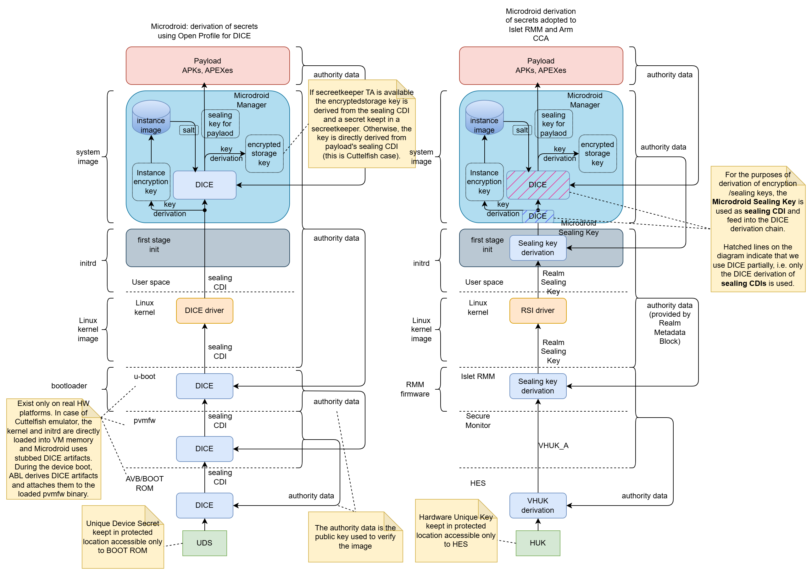
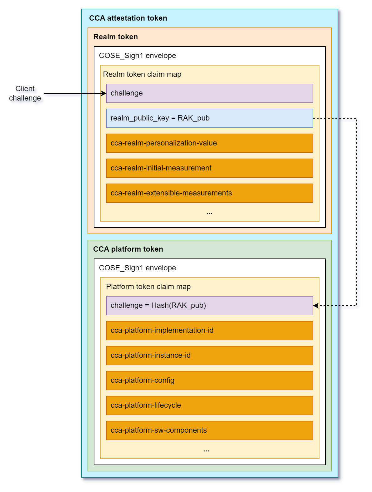

# Arm CCA and Microdroid Integration

## Overview

This document describes the integration of **ARM Confidential Compute Architecture (CCA)** with **Microdroid** as part of **Android Virtualization Framework (AVF)**. The integration enables secure execution of [Android bound services](https://developer.android.com/develop/background-work/services/bound-services) within isolated realms while maintaining compatibility with existing Android development practices. Key aspects of this integration include a robust **sealing key** derivation mechanism partially based on the **Open profile for DICE** (Device Identifier Composition Engine) specification and an ARM CCA-compliant **remote attestation** process that ensures system integrity from boot to runtime.

## Sealing Key Derivation

The derivation of secrets (encryption/sealing keys) in the Android Virtualization Framework (AVF) and Microdroid relies on the [**Open Profile for DICE**](https://pigweed.googlesource.com/open-dice/+/HEAD/docs/specification.md)  and [**Android Profile for DICE**](https://pigweed.googlesource.com/open-dice/+/HEAD/docs/android.md) specifications, which provide a standardized approach to cryptographic key derivation in layered software systems.

In our solution, we combine the **Islet RMM** sealing key derivation process with the DICE Sealing key derivation in Microdroid Manager. The diagram in Figure 1 illustrates how the existing architecture has been adapted to implement our sealing key derivation mechanism within the Microdroid environment.

*Figure 1: Sealing key derivation process in the original AVF and our solution*

### Process Overview

The sealing key derivation process is a multi-stage procedure that ensures cryptographic keys are securely bound to specific realm and payload identities while maintaining resistance to unauthorized access and tampering. The process in Microdroid begins with the retrieval of a **Realm Sealing Key** from the **Islet RMM** through the **Realm Service Interface** (RSI) kernel driver by the first stage init process.

### Detailed Derivation Steps

1. **Realm Sealing Key Retrieval**: The Islet RMM provides a **Realm Sealing Key** that is cryptographically bound to the realm's authority data (Check the definition of Authority data in [Open Profile for DICE](https://pigweed.googlesource.com/open-dice/+/HEAD/docs/specification.md#input-values)), which includes the identity of the realm developer and the realm identity itself. This binding is achieved through the "Realm Metadata" mechanism, ensuring that the key remains resistant to realm updates such as kernel or initrd image modifications.

2. **Microdroid Sealing Key Generation**: During the first-stage initialization process, the Realm Sealing Key serves as the **Input Keying Material** (IKM) for an **HKDF** (HMAC-based Key Derivation Function) operation. The authority data of the system image (Microdroid system image) is incorporated as additional input material to derive the **Microdroid Sealing Key**.

3. **Secure Key Transfer**: The derived **Microdroid Sealing Key** is securely transferred to the Microdroid environment through a dedicated file stored on a separate, protected partition. This isolation ensures that the key material is not accessible to other system components during the boot process.

4. **System Initialization**: After the secure key transfer, the initialization process mounts the system partition and launches the **Microdroid Manager**, which is responsible for the next stage of key derivation.

5. **DICE-based Key Derivation**: The Microdroid Manager utilizes the received sealing key as input for the existing DICE-based sealing key derivation process. This process generates separate keys for:
   - Encrypted storage (encryptedstore)
   - CC Service (Microdroid payload in AVF nomenclature)

6. **Key Destruction and Binding**: Upon successful derivation of the required keys, the **Microdroid Sealing Key** is securely destroyed to minimize exposure. The final derived keys for the CC Service and encrypted storage are cryptographically bound to the authority data of:
   - The provided APK (containing the Confidential Computing Service)
   - Associated APEX packages (such as the ART runtime)

   These components collectively form the Microdroid Payload, ensuring that the derived keys are uniquely tied to the specific service implementation and its concrete dependencies.

## Remote Attestation

The Android Virtualization Framework originally utilized the Open Profile for DICE specification to generate certificate chains containing evidence of system integrity. In the standard AVF implementation, the DICE chains are used in a remote attestation process that typically involves a two-phase approach with the [**Remote Key Provisioning**](https://source.android.com/docs/core/ota/modular-system/remote-key-provisioning) (RKP) Mechanism and an external RKP server.

### ARM CCA Integration Approach

In our implementation, we have adopted the **ARM Confidential Compute Architecture** (CCA) methodology for remote attestation to better align with the hardware security features provided by ARM platforms. This approach requires careful consideration of how system measurements are captured and represented in the attestation token to accurately reflect the initial state of the realm.

This document only briefly describes the concepts of Arm CCA architecture. For more information, the reader should refer to the [**Arm CCA Security Model**](https://developer.arm.com/documentation/DEN0096/latest/) document. Regarding the detailed specification of **Realm Management Monitor** (Islet RMM implements that specification) and the format of the CCA attestation evidence, essential information can be found in [**ARM Realm Management Monitor specification**](https://developer.arm.com/documentation/den0137/1-0rel0/?lang=en) document.

The Arm CCA attestation evidence is called **CCA attestation token** and it contains two cryptographically signed documents:
- **CCA platform token**
- **Realm token**

*Figure 2: Attestation token format according to Arm RMM Specification (DEN0137, 1.0-rel0)*

The **CCA platform token** contains information (claims) about hardware and firmware components that constitute **CCA platform**. This includes a challenge (it contains a cryptographic binder to the Realm token, i.e., the hash of the public key used to verify Realm attestation token), platform identity information (implementation and instance id), lifecycle (e.g. debug mode is enabled), the list of measurements of software/firmware components (name, version, hash, signed id). The **CCA platform token** is generated by **Hardware Enforced Security** (HES) module and is signed using a dedicated key embedded in the HES.

The **Realm token** contains information about a Realm. Specifically, it contains **Realm Initial Measurement** (RIM) that is a fingerprint of initial memory content of a Realm right before launching it. There are also four **Realm Extensible Measurement** slots that can be extended by the software components running in a realm during runtime. Apart from measurements, the Realm token contains a challenge, which is a unique nonce coming from an external Relying Party or Verifier that allows to prove the freshness of the attestation evidence. It also contains a **Realm Public Key** (RAK) that is used to verify the integrity and authenticity of the Realm token (the realm token is signed by Islet RMM using a dedicated **Realm Attestation Key** retrieved from the **HES**).

### Measurement Architecture

To ensure comprehensive attestation of the system state, we have implemented a multi-layered measurement approach that captures critical system components at different stages of the boot process:

#### Islet RMM
The Islet RMM measures the initial content of a realm and reflects it in the **Realm Initial Measurement** (RIM). In the current architecture, the initial realm content contains: the Linux kernel image, the init RAM disk image, and the Device Tree Blob (DTB).

#### First-Stage Initialization Process
The first-stage init process is responsible for measuring the system image, which contains the **Microdroid Manager** and other critical system components. This measurement is extended into **Realm Extensible Measurement 0** (REM0) before the system image is mounted and the Microdroid Manager is launched. This ensures that the integrity of core system components is captured in the attestation evidence.

#### Microdroid Manager Measurements
The **Microdroid Manager**, as part of the system image, performs measurements of the attached APK(s) and APEX packages. These measurements are extended into **Realm Extensible Measurement 1** (REM1) immediately before launching the CC Service. This captures the integrity of the user-provided confidential computing service and its dependencies (additional APEX files).

### CCA Attestation Token Structure

Once the CC Service is successfully launched, the **Realm token** contains a comprehensive set of measurements that provide evidence of system integrity:

1. **Realm Initial Measurement (RIM)**: Covers measurements of the kernel, initrd image, and device tree blob, providing evidence of the initial boot environment.

2. **Realm Extensible Measurement 0 (REM0)**: Contains measurements of the system image, including the Microdroid Manager and other critical system components that are loaded during the early boot process.

3. **Realm Extensible Measurement 1 (REM1)**: Encompasses measurements of the attached APK(s) and APEX packages that constitute the Microdroid Payload, ensuring that the confidential computing service and its dependencies are verified.

The **CCA platform token** includes crucial measurement information about the hardware and software/firmware components that constitute the CCA platform (HW, bootloaders, Secure Monitor, Islet RMM firmware, etc.).

This layered measurement approach ensures that remote parties can verify the integrity of the entire platform and the execution environment, from the initial platform boot, realm kernel boot through the loading of the confidential computing service.
