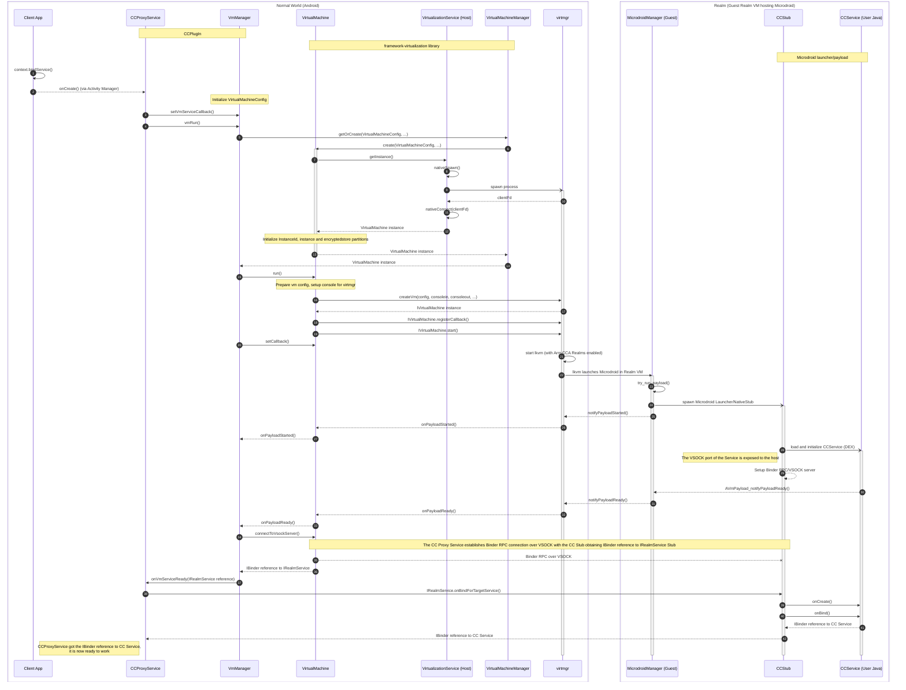

```mermaid
sequenceDiagram
    autonumber
    box Normal World (Android)
      participant C as Client App
      participant P as CCProxyService
      participant V as VmManager
      participant VM as VirtualMachine
      participant VS as VirtualizationService (Host)
      participant VMM as VirtualMachineManager
      participant VMGR as virtmgr
    end
    box Realm (Guest Realm VM hosting Microdroid)
      participant MM as MicrodroidManager (Guest)
      participant CCS as CCStub
      participant CCSE as CCService (User Java)
    end

    %% ---------- Boot & Connect Phase ----------
    Note over P, V: CCPlugIn
    Note over VM, VMM: framework-virtualization library
    Note over CCS, CCSE: Microdroid launcher/payload
    C->>C: context.bindService()
    C-->>P: onCreate() (via Activity Manager)
    note over V: Initialize VirtualMachineConfig
    P->>V:setVmServiceCallback()
    P->>V:vmRun()
    V->>VMM:getOrCreate(VirtualMachineConfig, ...)
    VMM->>VM:create(VirtualMachineConfig, ...)
    activate VM
    VM->>VS:getInstance()
    VS->>VS:nativeSpawn()
    VS-)VMGR: spawn process
    activate VMGR
    VMGR-->>VS: clientFd
    VS->>VS:nativeConnect(clientFd)
    VS-->>VM: VirtualMachine instance
    Note over VM: Initialize InstanceId, instance and encryptedstore partitions
    VM-->>VMM: VirtualMachine instance
    deactivate VM
    VMM-->>V: VirtualMachine instance
    V->>VM:run()
    Note over VM: Prepare vm config, setup console for virtmgr
    VM->>VMGR:createVm(config, consolein, consoleout, ...)
    VMGR-->>VM: IVirtualMachine instance
    VM->>VMGR: IVirtualMachine.registerCallback()
    VM->>VMGR: IVirtualMachine.start()
    V->>VM:setCallback()
    VMGR->>VMGR: start lkvm (with Arm CCA Realms enabled)
    VMGR->>MM: lkvm launches Microdroid in Realm VM
    activate MM
    MM->>MM: try_run_payload()
    MM-)CCS: spawn Microdroid Launcher/NativeStub
    activate CCS
    MM-->>VMGR: notifyPayloadStarted()
    VMGR-->>VM: onPayloadStarted()
    VM-->>V: onPayloadStarted()
    CCS-)CCSE: load and initialize CCService (DEX)
    activate CCSE
    note left of CCS: The VSOCK port of the Service is exposed to the host
    CCS-->>CCS: Setup Binder RPC/VSOCK server
    CCSE-->>MM: AVmPayload_notifyPayloadReady()
    MM-->>VMGR: notifyPayloadReady()
    VMGR-->>VM: onPayloadReady()
    VM-->>V: onPayloadReady()
    V->>VM: connectToVsockServer()
    Note over VM, CCS: The CC Proxy Service establishes Binder RPC connection over VSOCK with the CC Stub obtaining IBinder reference to IRealmService Stub
    VM--xCCS: Binder RPC over VSOCK
    VM-->>V: IBinder reference to IRealmService
    V->>P: onVmServiceReady(IRealmService reference)
    P->>CCS: IRealmService.onBindForTargetService()
    CCS->>CCSE: onCreate()
    CCS->>CCSE: onBind()
    CCSE-->>CCS: IBinder reference to CC Service
    CCS-->>P: IBinder reference to CC Service
    note left of P: CCProxyService got the IBinder reference to CC Service,<br>it is now ready to work
    deactivate CCSE
    deactivate CCS
    deactivate MM
    deactivate VMGR
```
