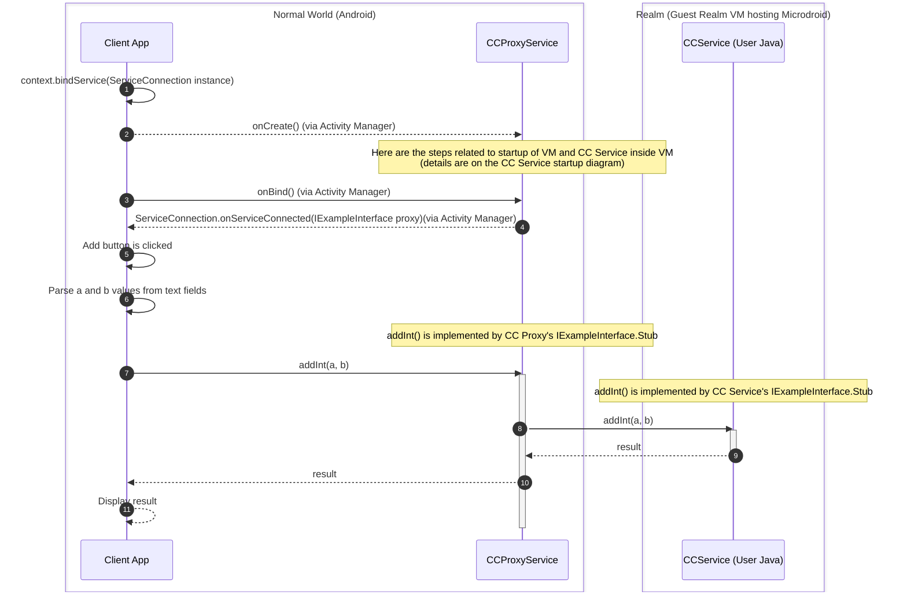

```mermaid
sequenceDiagram
    autonumber
    box Normal World (Android)
      participant C as Client App
      participant P as CCProxyService
    end
    box Realm (Guest Realm VM hosting Microdroid)
      participant CCSE as CCService (User Java)
    end

    %% ---------- End to End call ----------
    C->>C: context.bindService(ServiceConnection instance)
    C-->>P: onCreate() (via Activity Manager)
    Note over P: Here are the steps related to startup of VM and CC Service inside VM<br>(details are on the CC Service startup diagram)
    C->>P: onBind() (via Activity Manager)
    P-->>C: ServiceConnection.onServiceConnected(IExampleInterface proxy)(via Activity Manager)
    C->>C: Add button is clicked
    C->>C: Parse a and b values from text fields
    Note over P: addInt() is implemented by CC Proxy's IExampleInterface.Stub
    C->>P: addInt(a, b)
    activate P
    Note over CCSE: addInt() is implemented by CC Service's IExampleInterface.Stub
    P->>CCSE: addInt(a, b)
    activate CCSE
    CCSE-->>P: result
    deactivate CCSE
    P-->>C: result
    C-->>C: Display result
    deactivate P
```
