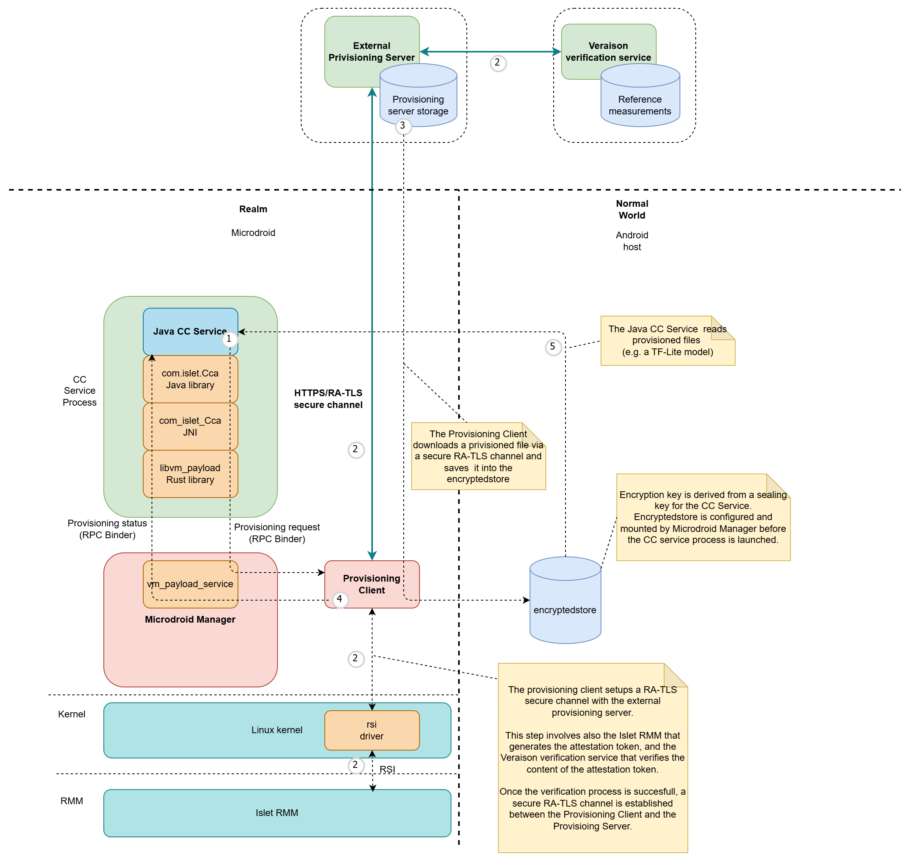

# Provisioning of Confidential Data

## Overview

In the context of **Confidential Computing**, provisioning is a critical process that enables the secure delivery of sensitive assets to isolated **Trusted Execution Environments** (TEE). This mechanism ensures that confidential data, such as machine learning models, cryptographic keys, or proprietary algorithms, can be safely transferred to a secure realm without exposing them to the untrusted host environment.

The provisioning process is essential for various use cases in confidential computing:
- **Confidential Machine Learning Model Deployment**: Securely delivering trained ML models to a confidential realm where they can process sensitive user data without exposing the model intellectual property
- **Confidential Data Processing**: Providing sensitive datasets that need to be processed within a secure environment while maintaining their confidentiality
- **Cryptographic Key Management**: Safely provisioning encryption keys or other cryptographic material required for secure operations within the confidential environment
- **Licensed Software Distribution**: Delivering proprietary software components or libraries to a secure execution context

The provisioning process leverages **remote attestation** to establish trust between the **provisioning server** and the confidential realm (a confidential VM in Arm CCA architecture) before any sensitive data is transferred. This ensures that assets are only delivered to verified, authorized execution environments, maintaining the confidentiality and integrity guarantees essential to confidential computing.

## Description of the Provisioning Process

*Figure 1: Provisioning flow*

The provisioning process implemented in our solution follows these key steps to securely deliver confidential assets to the execution environment:

1. **Provisioning Request Initiation**: A Java **CC Service** initiates the provisioning process by calling the `startProvisioning()` method on the `com.islet.Cca` class. The service provides the URL of the resource to be provisioned and specifies the destination path within the **encrypted store** mount point. The CC Service establishes a connection with the `vm_payload_service` (a component of Microdroid Manager) through the [**Binder RPC**](https://source.android.com/docs/core/virtualization/microdroid?hl=en#binder-rpc) interface. The provisioning request is then sent to the `vm_payload_service`, which launches a dedicated **Provisioning Client** with all necessary parameters, including the URL and destination path.

2. **Secure Channel Establishment**: The **Provisioning Client** establishes a secure channel with the **Provisioning Server** using the **RA-TLS** (Remote Attestation Transport Layer Security) protocol. Within the Realm, this step involves the RSI driver and Islet RMM to fetch the attestation token. On the provisioning server side, the [**Veraison**](https://github.com/veraison) verification service is used to verify the attestation evidence. Once remote attestation is successfully completed, a secure encrypted channel is established between the Provisioning Client and the Provisioning Server.

3. **Asset Download and Storage**: The **Provisioning Client** downloads the requested file from the **Provisioning Server** and securely saves it in the **encrypted store**, ensuring that the confidential asset remains protected at rest.

4. **Process Completion Notification**: Upon successful completion of the provisioning process, the Java **CC Service** is notified through the Binder RPC interface, indicating the requested asset is now available.

5. **Asset Utilization**: The Java **CC Service** can then access and read the provisioned file to perform its intended Confidential Computing operations, such as processing sensitive data with a provisioned machine learning model or utilizing the provisioned cryptographic keys.
